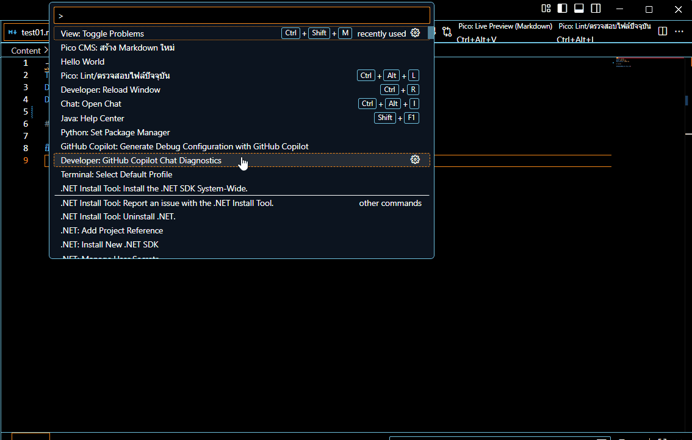
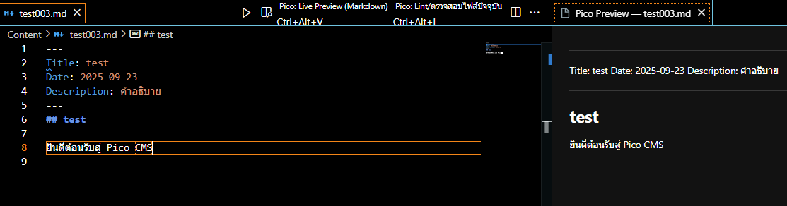
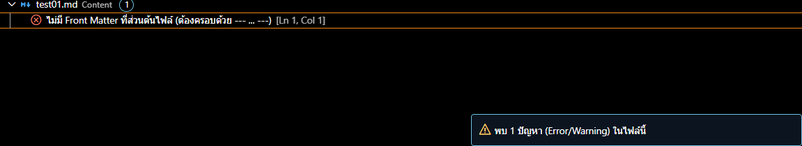
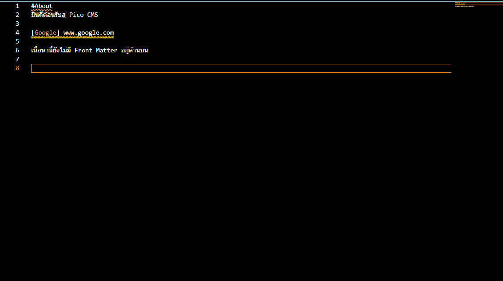

# Pico Helper

> VS Code extension by **Bittzt (Boo)** designed to support **Pico CMS** content and theme development.  
> รองรับ Markdown + Twig พร้อม Lint, Live Preview, Snippet/Autocomplete และ Quick Fix

---

## ✨ Features

### 📝 Create Markdown (พร้อม Front Matter)
**TH:**  
คำสั่ง `Pico CMS: สร้าง Markdown ใหม่` สร้างไฟล์ `.md` ที่มี Front Matter มาตรฐาน (`Title`, `Date`, `Description`, `Template`, `Tags`)  
- ถ้ามีไฟล์ชื่อซ้ำ: จะแสดง **ยืนยันเขียนทับ** ก่อนเสมอ  
- สร้างเสร็จ: เปิดไฟล์ + โชว์ใน Explorer + เปิด Live Preview ให้อัตโนมัติ  

**EN:**  
Command `Pico CMS: Create Markdown` creates a new `.md` file with a pre-filled Front Matter block (`Title`, `Date`, `Description`, `Template`, `Tags`).  
- If a file with the same name exists, confirmation will appear before overwriting.  
- After creation, the file automatically opens in the editor, is shown in Explorer, and Live Preview launches instantly.  

---

### 👀 Live Preview (Markdown)
**TH:**  
แสดงผล Markdown แบบเรียลไทม์ใน VS Code (`Ctrl+Alt+V`)  
**EN:**  
Real-time Markdown preview within VS Code (`Ctrl+Alt+V`).

---

### 🧩 Lint + Status Bar + Quick Fix
**TH:**  
ตรวจสอบ Markdown และ Twig อัตโนมัติ พร้อมแสดงผลใน Problems Panel และแถบสถานะด้านล่าง  
**EN:**  
Automatically checks Markdown and Twig files, with issues shown in the Problems Panel and the status bar.

- **Markdown Rules:**
  - Front Matter ว่าง/หาย  
  - `Date` ต้องเป็น `YYYY-MM-DD`  
  - `Template` แนะนำให้ใส่ (Hint)  
  - `Tags` ควรเป็น `[tag1, tag2]`  
  - หัวข้อแบบ `#About` → ต้องเว้นวรรคเป็น `# About`  
  - ลิงก์ผิดรูปแบบ `[text]www.example.com` → ควรเป็น `[text](url)`  

- **Twig Rules:**
  - `include` ต้องลงท้าย `.twig`  
  - ตรวจสอบคู่ `if/for/block` ↔ `endif/endfor/endblock`

- **Quick Fix (`Ctrl+.`)**  
  - เพิ่ม Front Matter อัตโนมัติ  
  - ใส่ช่องว่างหลัง `#` ให้อัตโนมัติ  
  - ครอบลิงก์ให้เป็น `[text](https://url)`

---

### ⚡ Snippets & Autocomplete
**TH:**  
- Markdown → `pico-front` (Front Matter ครบชุด)  
- Twig → `twig-block`, `twig-include`

**EN:**  
- Markdown → `pico-front` snippet for complete Front Matter block  
- Twig → `twig-block`, `twig-include` snippets for faster template writing  

---

## 🧭 Commands & Keybindings

| Command | Title | Keybinding |
|:---|:---|:---|
| `pico-helper.createMarkdown` | Pico CMS: สร้าง Markdown ใหม่ | – |
| `pico-helper.preview` | Pico: Live Preview (Markdown) | `Ctrl+Alt+V` / `Cmd+Alt+V` |
| `pico-helper.lintFile` | Pico: Lint/ตรวจสอบไฟล์ปัจจุบัน | `Ctrl+Alt+L` / `Cmd+Alt+L` |
| `pico-helper.helloWorld` | Hello World | – |

---

## 🖼️ Screenshots

### 🧾 Create Markdown  
  
> **TH:** ตัวอย่างการสร้างไฟล์ Markdown ใหม่ พร้อม Front Matter ที่ถูกเติมให้อัตโนมัติ  
> **EN:** Demonstration of automatic Markdown creation with pre-filled Front Matter.

---

### 🪄 Live Preview  
  
> **TH:** แสดงตัวอย่าง Markdown แบบเรียลไทม์ภายใน VS Code  
> **EN:** Real-time Markdown preview inside VS Code editor.

---

### ⚙️ Lint Status Bar  
  
> **TH:** แสดงจำนวนข้อผิดพลาดหรือคำเตือนของไฟล์ปัจจุบัน และคลิกเพื่อเปิด Problems Panel  
> **EN:** Shows error/warning count for the current file. Click to open the Problems Panel.

---

### 💡 Quick Fix  
  
> **TH:** ตัวอย่างการแก้ไข Front Matter อัตโนมัติและการเพิ่มรูปแบบที่ถูกต้องให้ Markdown  
> **EN:** Demonstration of Quick Fix for missing Front Matter and Markdown formatting.

---

## ⚙️ Requirements

- VS Code **1.102.0** หรือใหม่กว่า / or newer  
- (สำหรับนักพัฒนา) ต้องมี Node.js + npm / Requires Node.js + npm if developing further

---

## 🔧 Extension Settings / Defaults

**TH:**  
ส่วนขยายนี้ตั้งค่าเริ่มต้นให้ **Markdown** และ **Twig** ดังนี้:  
**EN:**  
Default editor settings for **Markdown** and **Twig** include:  
- `editor.snippetSuggestions: "top"`  
- Enabled: `suggestOnTriggerCharacters`, `quickSuggestions`  
- Disabled: `wordBasedSuggestions`

---

## 🐞 Known Issues

- **TH:** Lint Front Matter ยังเป็นแบบเบื้องต้น (YAML ซับซ้อนมาก ๆ อาจแจ้งเตือนไม่ครบ)  
- **EN:** Front Matter Lint is still basic — complex YAML may not be fully validated.  
- **TH:** ยังไม่พรีวิว Twig/ธีม Pico ทั้งชุด (อยู่ใน Roadmap)  
- **EN:** Full Twig/Theme preview not implemented yet (on the roadmap).  

---

## 🗺️ Roadmap

- เพิ่ม Quick Fix สำหรับ `Date`, `Tags`, และการเคาะบรรทัดรอบหัวข้อ  
- พรีวิว Twig + Theme (อ่านไฟล์ในโฟลเดอร์ theme)  
- ตัวเลือกเปิด/ปิดกฎ Lint รายข้อจาก Settings  

**EN:**  
- Add Quick Fix for `Date`, `Tags`, and heading spacing.  
- Implement Twig + Theme preview.  
- Add configurable Lint rule toggles in settings.

---

## 📝 Release Notes

### 0.0.5  
- ปรับปรุง **Lint** ให้ทำงานได้เสถียร ลด false error/warning  
- ตรวจสอบ Front Matter + Markdown + Twig ครบโดยไม่เจอ Error ที่ไม่ควรมี  
**EN:** Improved Lint stability and accuracy. Handles Front Matter, Markdown, and Twig with fewer false positives.

### 0.0.4  
- ขยายกฎ **Lint** ครอบคลุม:  
  - Date format (YYYY-MM-DD)  
  - Template แนะนำให้ใส่  
  - Tags ต้องอยู่ใน `[]`  
  - จับ error เมื่อ key ใน Front Matter ไม่ตามด้วย `:`  
  - Twig include ลงท้าย `.twig` + ตรวจคู่ block/if/for  
**EN:** Expanded Lint coverage for Front Matter and Twig templates.

### 0.0.3  
- **Live Preview (Markdown)** เสร็จสมบูรณ์  
- เพิ่ม **Lint เริ่มต้น** (Front Matter / Heading / Links / Twig basic)  
- เพิ่ม **Status Bar Lint** + ปุ่มเปิด Problems  
- เพิ่ม **Quick Fix** (Front Matter / # heading space / Markdown link)  
**EN:** Completed Live Preview and added initial Lint + Quick Fix support.

### 0.0.2  
- เพิ่ม **Autocomplete / Snippets**  
  - Markdown: `pico-front`  
  - Twig: `twig-block`, `twig-include`  
- Live Preview เวอร์ชันแรก (เบื้องต้น)  
**EN:** Introduced Snippets & early Live Preview version.

### 0.0.1  
- ฟีเจอร์เริ่มต้น: **Create Markdown + Front Matter**  
- คำสั่ง `pico-helper.createMarkdown` พร้อมสร้างไฟล์ใหม่อัตโนมัติ  
**EN:** Initial version – added Markdown creation with default Front Matter.

---

## 📖 More Info

- [Pico CMS Docs](https://picocms.org/docs)  
- [VS Code Extension API](https://code.visualstudio.com/api)

---

**TH:** ขอให้สนุกกับการทำคอนเทนต์บน Pico CMS ด้วย VS Code! 🚀  
**EN:** Enjoy building your Pico CMS content with VS Code! 🚀
