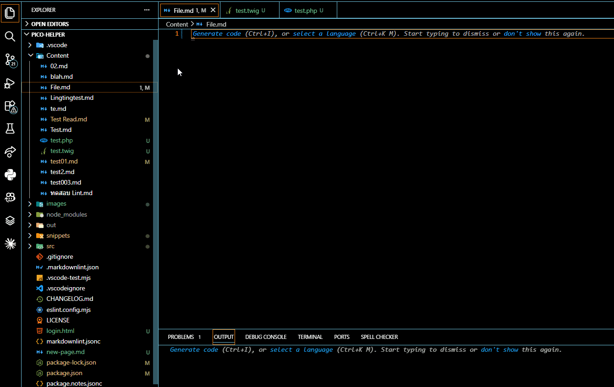
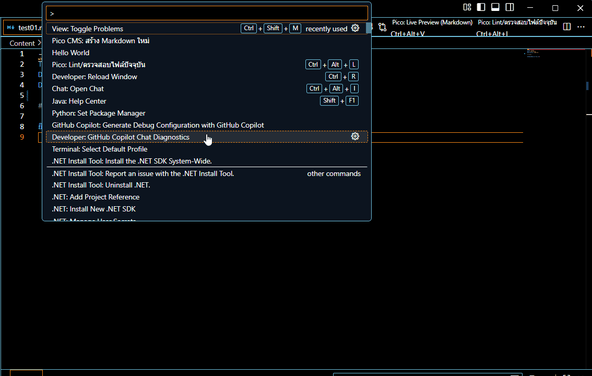
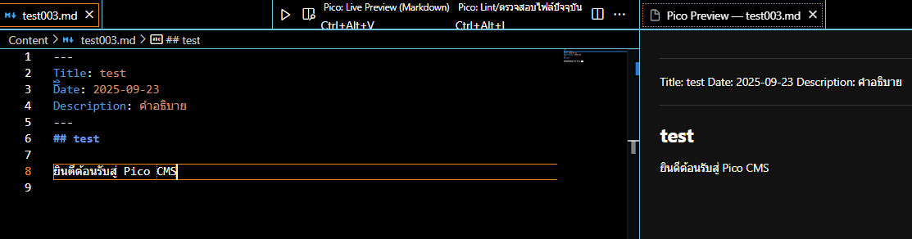
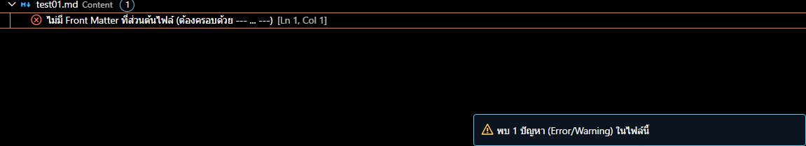
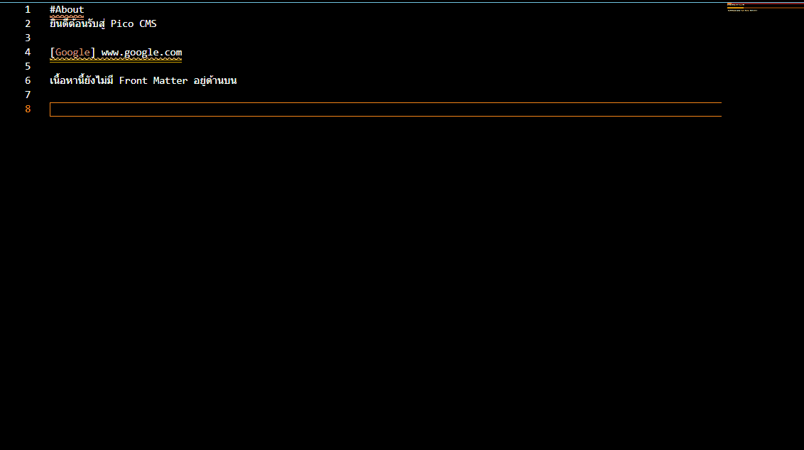

# Pico Helper

> VS Code extension by **Bittzt (Boo)** designed to support **Pico CMS** content and theme development.  
> รองรับ Markdown + Twig พร้อม PHP Snippets, Lint, Live Preview, Snippet/Autocomplete, Quick Fix และ Sidebar ครบชุด

---

## ✨ Features

### 📝 Create Markdown (พร้อม Front Matter)
**TH:**  
คำสั่ง `Pico CMS: สร้าง Markdown ใหม่` สร้างไฟล์ `.md` ที่มี Front Matter มาตรฐาน (`Title`, `Date`, `Description`, `Template`, `Tags`)  
- ถ้ามีไฟล์ชื่อซ้ำ: จะแสดง **ยืนยันเขียนทับ** ก่อนเสมอ  
- สร้างเสร็จ: เปิดไฟล์ + โชว์ใน Explorer + เปิด Live Preview ให้อัตโนมัติ  

**EN:**  
Command `Pico CMS: Create Markdown` creates a new `.md` file with a pre-filled Front Matter block (`Title`, `Date`, `Description`, `Template`, `Tags`).  
- If a file with the same name exists, confirmation will appear before overwriting.  
- After creation, the file automatically opens in the editor, is shown in Explorer, and Live Preview launches instantly.  

---

### 👀 Live Preview (Markdown)
**TH:**  
แสดงผล Markdown แบบเรียลไทม์ใน VS Code (`Ctrl+Alt+V`)  
**EN:**  
Real-time Markdown preview within VS Code (`Ctrl+Alt+V`).

---

### 🧩 Lint + Status Bar + Quick Fix
**TH:**  
ตรวจสอบ Markdown และ Twig อัตโนมัติ พร้อมแสดงผลใน Problems Panel และแถบสถานะด้านล่าง  
**EN:**  
Automatically checks Markdown and Twig files, with issues shown in the Problems Panel and the status bar.

- **Markdown Rules:**
  - Front Matter ว่าง/หาย  
  - `Date` ต้องเป็น `YYYY-MM-DD`  
  - `Template` แนะนำให้ใส่ (Hint)  
  - `Tags` ควรเป็น `[tag1, tag2]`  
  - หัวข้อแบบ `#About` → ต้องเว้นวรรคเป็น `# About`  
  - ลิงก์ผิดรูปแบบ `[text]www.example.com` → ควรเป็น `[text](url)`  

- **Twig Rules:**
  - `include` ต้องลงท้าย `.twig`  
  - ตรวจสอบคู่ `if/for/block` ↔ `endif/endfor/endblock`

- **Quick Fix (`Ctrl+.`)**  
  - เพิ่ม Front Matter อัตโนมัติ  
  - ใส่ช่องว่างหลัง `#` ให้อัตโนมัติ  
  - ครอบลิงก์ให้เป็น `[text](https://url)`

---

### 🗂 Sidebar Panel
**TH:**  
เปิด Pico Helper Sidebar จากแถบ Activity Bar (ด้านซ้ายของ VS Code) เพื่อเข้าถึงคำสั่งทั้งหมดได้ในที่เดียว โดยจัดกลุ่มตามหมวดหมู่

**EN:**  
Open the Pico Helper Sidebar from the Activity Bar (left side of VS Code) to access all commands in one place, organized by category.

| หมวด / Category | ปุ่ม / Buttons |
|:---|:---|
| **General** | New Markdown, Preview, Lint File |
| **Content** | `!page`, `!blog` |
| **Theme (Twig)** | `!layout`, `!nav`, `!pagelist` |
| **PHP Plugin** | `!plugin` |
| **Auth / Forms** | `!login`, `!register`, `!forgot`, `!contact`, `!profile`, `!logout` |
| **Snippet Picker** | Markdown, Twig, PHP |

---

### ⚡ Snippets & Autocomplete

#### Markdown (`.md`)
| Prefix | คำอธิบาย |
|:---|:---|
| `!page` | Front matter + เนื้อหาสำหรับหน้าทั่วไป |
| `!blog` | Front matter ครบชุดสำหรับบทความ (date, tags, author) |
| `!fm` | Front matter เปล่าสำหรับกรอกเอง |
| `!fmfull` | Front matter แบบเต็มทุก field ที่ Pico รองรับ |
| `pico-front` | Front matter ผ่าน autocomplete (พิมพ์ `p`) |

#### Twig (`.twig` / `.html`)
| Prefix | คำอธิบาย |
|:---|:---|
| `!layout` | Base layout ครบทุก block (`head`, `header`, `main`, `footer`) |
| `!childpage` | Child template ที่ extends layout |
| `!nav` | Navigation loop พร้อม active state |
| `!pagelist` | แสดงรายการ pages/posts พร้อม meta |
| `!meta` | SEO meta + Open Graph + Twitter Card |
| `!pagination` | Prev/Next page links |
| `!breadcrumb` | Auto breadcrumb จาก page ID |
| `!loginform` | HTML login form |
| `!registerform` | HTML register form |
| `!contactform` | HTML contact form |
| `!flash` | Flash message (success/error) |
| `!dump` | Debug dump Twig variable (ลบก่อน deploy) |
| `twig-block` | `...` |
| `twig-include` | `` |
| `twig-for` | `...` |
| `twig-if` | `...` |

#### PHP (`.php`)
| Prefix | คำอธิบาย |
|:---|:---|
| `!plugin` | โครงสร้าง Pico Plugin class พร้อม DI |
| `!hook` | Event hook method (dropdown เลือกชื่อได้) |
| `!hookConfig` | `onConfigLoaded` — อ่าน/แก้ config |
| `!hookPages` | `onPagesLoaded` — จัดการ pages array |
| `!hookRender` | `onPageRendered` — แก้ HTML output |
| `!hookTwig` | `onTwigRegistration` — เพิ่ม Twig filter/function |
| `!hookMeta` | `onMetaParsed` — เพิ่ม/แก้ meta fields |
| `!hookPageRendering` | `onPageRendering` — เพิ่ม Twig variables |
| `!login` | PHP login handler + CSRF |
| `!register` | PHP register handler + validation |
| `!forgot` | Forgot password + token generation |
| `!contact` | Contact form handler + `mail()` |
| `!profile` | Profile update handler |
| `!logout` | Logout + ล้าง session/cookie ครบ |
| `!authguard` | ป้องกันหน้าที่ต้อง login ก่อนเข้า |
| `!csrf` | HTML hidden input สำหรับ CSRF token |

---

### 🐘 Snippet Picker
**TH:**  
กดปุ่ม Markdown / Twig / PHP ใน Sidebar เพื่อเปิด Quick Pick เลือก snippet แล้วแทรกเข้าไฟล์ปัจจุบันได้เลย ไม่ต้องจำ prefix  
**EN:**  
Click the Markdown / Twig / PHP buttons in the Sidebar to open a Quick Pick menu — browse and insert snippets without memorizing prefixes.

---

## 🧭 Commands & Keybindings

| Command | Title | Keybinding |
|:---|:---|:---|
| `pico-helper.createMarkdown` | Pico CMS: สร้าง Markdown ใหม่ | – |
| `pico-helper.preview` | Pico: Live Preview (Markdown) | `Ctrl+Alt+V` / `Cmd+Alt+V` |
| `pico-helper.lintFile` | Pico: Lint/ตรวจสอบไฟล์ปัจจุบัน | `Ctrl+Alt+L` / `Cmd+Alt+L` |
| `pico-helper.login` | Pico: !login — Insert Login Template | – |
| `pico-helper.register` | Pico: !register — Insert Register Template | – |
| `pico-helper.forgot` | Pico: !forgot — Insert Forgot Password Handler | – |
| `pico-helper.contact` | Pico: !contact — Insert Contact Form Handler | – |
| `pico-helper.profile` | Pico: !profile — Insert Profile Update Handler | – |
| `pico-helper.logout` | Pico: !logout — Insert Logout Handler | – |
| `pico-helper.plugin` | Pico: !plugin — Insert Pico Plugin Class | – |
| `pico-helper.layout` | Pico: !layout — Insert Base Twig Layout | – |
| `pico-helper.nav` | Pico: !nav — Insert Twig Navigation | – |
| `pico-helper.pagelist` | Pico: !pagelist — Insert Twig Page Listing | – |
| `pico-helper.page` | Pico: !page — Insert Pico Page (Markdown) | – |
| `pico-helper.blog` | Pico: !blog — Insert Blog Post (Markdown) | – |

---

## 🖼️ Screenshots

### 🧭 Sidebar Panel

> **TH:** แถบ Sidebar สำหรับรวมเครื่องมือ Pico Helper ไว้ในที่เดียว สามารถเข้าถึงคำสั่งหลัก, snippets และ template ต่าง ๆ ได้อย่างรวดเร็วโดยไม่ต้องจำ prefix หรือใช้ command palette
> **EN:** A dedicated Sidebar panel that centralizes all Pico Helper tools. Quickly access core commands, snippets, and templates without memorizing prefixes or using the command palette.

### 🧾 Create Markdown

> **TH:** ตัวอย่างการสร้างไฟล์ Markdown ใหม่ พร้อม Front Matter ที่ถูกเติมให้อัตโนมัติ  
> **EN:** Demonstration of automatic Markdown creation with pre-filled Front Matter.

### 🪄 Live Preview

> **TH:** แสดงตัวอย่าง Markdown แบบเรียลไทม์ภายใน VS Code  
> **EN:** Real-time Markdown preview inside VS Code editor.

### ⚙️ Lint Status Bar

> **TH:** แสดงจำนวนข้อผิดพลาดหรือคำเตือนของไฟล์ปัจจุบัน คลิกเพื่อเปิด Problems Panel  
> **EN:** Shows error/warning count for the current file. Click to open the Problems Panel.

### 💡 Quick Fix

> **TH:** ตัวอย่างการแก้ไข Front Matter อัตโนมัติและการเพิ่มรูปแบบที่ถูกต้องให้ Markdown  
> **EN:** Demonstration of Quick Fix for missing Front Matter and Markdown formatting.

---

## ⚙️ Requirements

- VS Code **1.102.0** หรือใหม่กว่า / or newer  
- (สำหรับนักพัฒนา) ต้องมี Node.js + npm / Requires Node.js + npm if developing further

---

## 🔧 Extension Settings / Defaults

**TH:**  
ส่วนขยายนี้ตั้งค่าเริ่มต้นให้ **Markdown**, **Twig** และ **PHP** ดังนี้:  
**EN:**  
Default editor settings for **Markdown**, **Twig**, and **PHP** include:

- `editor.snippetSuggestions: "top"`
- Enabled: `suggestOnTriggerCharacters`, `quickSuggestions`
- Disabled: `wordBasedSuggestions` (Markdown & Twig)

---

## 🐞 Known Issues

- **TH:** Lint Front Matter ยังเป็นแบบเบื้องต้น (YAML ซับซ้อนมาก ๆ อาจแจ้งเตือนไม่ครบ)  
- **EN:** Front Matter Lint is still basic — complex YAML may not be fully validated.  
- **TH:** ยังไม่พรีวิว Twig/ธีม Pico ทั้งชุด (อยู่ใน Roadmap)  
- **EN:** Full Twig/Theme preview not implemented yet (on the roadmap).  

---

## 🗺️ Roadmap

- เพิ่ม Quick Fix สำหรับ `Date`, `Tags`, และการเคาะบรรทัดรอบหัวข้อ  
- พรีวิว Twig + Theme (อ่านไฟล์ในโฟลเดอร์ theme)  
- ตัวเลือกเปิด/ปิดกฎ Lint รายข้อจาก Settings  

**EN:**  
- Add Quick Fix for `Date`, `Tags`, and heading spacing.  
- Implement Twig + Theme preview.  
- Add configurable Lint rule toggles in settings.

---

## 📝 Release Notes

### 0.0.15
- ขยาย snippet `!layout` และ `!theme` ให้รองรับ SEO meta เพิ่มเติม: `keywords`, `robots`, `canonical`, `theme-color`, `og:image`, `twitter:image` และ favicon placeholders
- เพิ่ม boilerplate meta/OG/Twitter card ในตัวอย่างธีม เพื่อให้ไขว้ใช้ได้กับทุกหน้าที่มี `meta.image`
- ปรับให้ `!layout` มี accessibility support เพิ่มเติม เช่น `skip-link`, `main id="main" role="main"`, และ navigation aria attribute

**EN:**
- Extended `!layout` and `!theme` snippets with extra SEO meta support: `keywords`, `robots`, `canonical`, `theme-color`, `og:image`, `twitter:image`, and favicon placeholders
- Added theme boilerplate for Open Graph and Twitter Card markup so demo pages can render social preview metadata when `meta.image` is present
- Improved snippet accessibility with `skip-link`, `main id="main" role="main"`, and a more semantic navigation aria label

### 0.0.14
- ปรับตัวอย่าง Twig snippets `!layout`, `!nav`, `!pagelist`, และ `!theme` ให้ใช้ markup และ class ที่พร้อมสำหรับ CSS ธีมมากขึ้น
- อัปเดตคำสั่ง `pico-helper.nav` และ `pico-helper.pagelist` ให้สร้าง template output แบบเดียวกับ snippets เพื่อให้ใช้งานได้ตรงกัน
- ปรับสไตล์ Login/Register template ในคำสั่ง `!login` และ `!register` ให้เป็นโค้ด CSS modern มากขึ้น พร้อม layout card แบบ responsive
- รองรับโครงสร้าง `<nav class="site-nav">`, `<ul class="site-menu">`, `<section class="page-list-section">`, และ `.page-list-item`

**EN:**
- Updated Twig snippets `!layout`, `!nav`, `!pagelist`, and `!theme` to emit cleaner markup and theme-ready CSS classes
- Synced generated output for `pico-helper.nav` and `pico-helper.pagelist` commands with the snippet definitions
- Improved the CSS styling of `!login` and `!register` templates for a modern card layout and responsive form design
- Added support for structured theme classes such as `<nav class="site-nav">`, `<ul class="site-menu">`, `<section class="page-list-section">`, and `.page-list-item`

---

### 0.0.13 
- แก้ไขปัญหาเวอร์ชันไม่ตรงกับ Marketplace  
- ปรับปรุงภายในเล็กน้อย 

**EN:**
- Fixed version mismatch with Marketplace  
- Minor internal improvements 

---

### 0.0.12
- เพิ่ม **Snippet Picker** — เลือก snippet จาก Quick Pick menu ใน Sidebar ได้เลย ไม่ต้องจำ prefix
- รองรับ snippet สำหรับ Markdown, Twig และ PHP แยก picker ชัดเจน

**EN:**
- Added **Snippet Picker** — browse and insert snippets from a Quick Pick menu directly in the Sidebar.
- Separate pickers for Markdown, Twig, and PHP snippets.

---

### 0.0.11
- เพิ่ม snippet ภาษา **PHP** ครบชุดสำหรับ Pico Plugin: `!plugin`, `!hook`, `!hookConfig`, `!hookPages`, `!hookRender`, `!hookTwig`, `!hookMeta`, `!hookPageRendering`
- เพิ่ม snippet **Auth/Form**: `!authguard`, `!csrf`
- เพิ่ม `[php]` ใน `configurationDefaults` เพื่อเปิด snippet suggestion สำหรับ PHP

**EN:**
- Added full **PHP snippet** set for Pico Plugin development.
- Added **Auth/Form** snippets: `!authguard`, `!csrf`.
- Added `[php]` to `configurationDefaults` for snippet suggestions in PHP files.

---

### 0.0.10
- เพิ่ม snippet **Twig** ครบชุด: `!layout`, `!childpage`, `!nav`, `!pagelist`, `!meta`, `!pagination`, `!breadcrumb`
- เพิ่ม snippet **form HTML** สำหรับ Twig: `!loginform`, `!registerform`, `!contactform`, `!flash`, `!dump`
- เพิ่ม snippet Twig shorthand: `twig-for`, `twig-if`
- ลงทะเบียน snippet Twig สำหรับภาษา HTML ด้วย

**EN:**
- Added full **Twig snippet** set for theme development.
- Added **form HTML snippets** for Twig templates.
- Added Twig shorthand snippets: `twig-for`, `twig-if`.
- Registered Twig snippets for HTML language as well.

---

### 0.0.9
- เพิ่ม snippet **Markdown** ใหม่: `!page`, `!blog`, `!fm`, `!fmfull`
- `!blog` รองรับ `date`, `tags`, `author` ครบ
- `!fmfull` รองรับทุก field ที่ Pico CMS อ่านได้ รวมถึง `Robots`, `Hidden`, `Image`

**EN:**
- Added new **Markdown snippets**: `!page`, `!blog`, `!fm`, `!fmfull`.
- `!blog` includes `date`, `tags`, and `author` fields.
- `!fmfull` covers every Front Matter field supported by Pico CMS.

---

### 0.0.8
- ปรับ **Sidebar UI** ใหม่ทั้งหมด — จัดกลุ่มปุ่มตามหมวด (General, Content, Theme, PHP Plugin, Auth/Forms, Snippet Picker)
- เพิ่มปุ่ม Sidebar: `!page`, `!blog`, `!layout`, `!nav`, `!pagelist`, `!plugin`
- เพิ่มคำสั่งใหม่: `forgot`, `contact`, `profile`, `logout`, `plugin`, `layout`, `nav`, `pagelist`, `page`, `blog`
- ใช้ CSS Grid 2 คอลัมน์ + VS Code CSS Variables ให้ Sidebar ปรับตาม theme อัตโนมัติ

**EN:**
- Fully redesigned **Sidebar UI** — buttons grouped by category.
- Added Sidebar buttons for `!page`, `!blog`, `!layout`, `!nav`, `!pagelist`, `!plugin`.
- Added 10 new commands for all new template types.
- CSS Grid 2-column layout using VS Code CSS Variables for automatic theme adaptation.

---

### 0.0.7  
- Maintenance release  
- Internal fixes and version alignment  
- No feature changes  

**TH:** ปรับเวอร์ชันและแก้ไขภายในเล็กน้อย ไม่มีการเปลี่ยนแปลงฟีเจอร์

---

### 0.0.6  
- เพิ่มหน้า **Login UI** ภายใน Extension (Webview Layout)  
- เพิ่มหน้า **Register UI** พร้อมช่อง Confirm Password  
- ปรับปรุง UI ให้ input และ button มีขนาดเท่ากัน (box-sizing fix)  
- เตรียมโครงสร้างสำหรับ Authentication Logic ในอนาคต  

**EN:**  
- Added **Login UI** inside the extension (Webview-based layout).  
- Added **Register UI** with Confirm Password field.  
- Improved UI consistency (inputs and buttons now properly aligned using box-sizing fix).  
- Prepared structure for future authentication logic integration.

---

### 0.0.5  
- ปรับปรุง **Lint** ให้ทำงานได้เสถียร ลด false error/warning  
- ตรวจสอบ Front Matter + Markdown + Twig ครบโดยไม่เจอ Error ที่ไม่ควรมี  
**EN:** Improved Lint stability and accuracy. Handles Front Matter, Markdown, and Twig with fewer false positives.

---

### 0.0.4  
- ขยายกฎ **Lint** ครอบคลุม:  
  - Date format (YYYY-MM-DD)  
  - Template แนะนำให้ใส่  
  - Tags ต้องอยู่ใน `[]`  
  - จับ error เมื่อ key ใน Front Matter ไม่ตามด้วย `:`  
  - Twig include ลงท้าย `.twig` + ตรวจคู่ block/if/for  
**EN:** Expanded Lint coverage for Front Matter and Twig templates.

---

### 0.0.3  
- **Live Preview (Markdown)** เสร็จสมบูรณ์  
- เพิ่ม **Lint เริ่มต้น** (Front Matter / Heading / Links / Twig basic)  
- เพิ่ม **Status Bar Lint** + ปุ่มเปิด Problems  
- เพิ่ม **Quick Fix** (Front Matter / # heading space / Markdown link)  
**EN:** Completed Live Preview and added initial Lint + Quick Fix support.

---

### 0.0.2  
- เพิ่ม **Autocomplete / Snippets**  
  - Markdown: `pico-front`  
  - Twig: `twig-block`, `twig-include`  
- Live Preview เวอร์ชันแรก (เบื้องต้น)  
**EN:** Introduced Snippets & early Live Preview version.

---

### 0.0.1  
- ฟีเจอร์เริ่มต้น: **Create Markdown + Front Matter**  
- คำสั่ง `pico-helper.createMarkdown` พร้อมสร้างไฟล์ใหม่อัตโนมัติ  
**EN:** Initial version – added Markdown creation with default Front Matter.

---

## 📖 More Info

- [Pico CMS Docs](https://picocms.org/docs)  
- [VS Code Extension API](https://code.visualstudio.com/api)

---

**TH:** ขอให้สนุกกับการทำคอนเทนต์บน Pico CMS ด้วย VS Code! 🚀  
**EN:** Enjoy building your Pico CMS content with VS Code! 🚀
